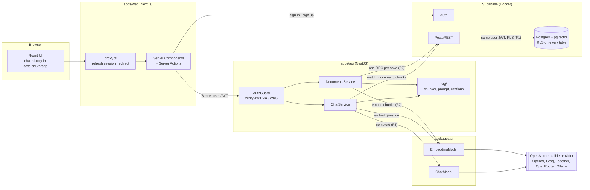

# Knowledge Base (RAG)

A full-stack knowledge base: users sign in, write documents (plain text or Markdown), and ask
questions that are answered **only** from their own documents, with citations that link back
to the source.

- **Monorepo:** pnpm workspaces + Turborepo
- **Web:** Next.js 16 (App Router, Server Actions), Tailwind
- **API:** NestJS 12
- **Data:** Supabase (Postgres 17 + pgvector, Auth, Row Level Security), run locally in Docker
- **AI:** any OpenAI-compatible provider behind two small interfaces; chat and embeddings are
  configured separately; a clearly labelled mock mode runs everything without an API key

**Walkthroughs:**

- App walkthrough (Loom): _link to be added_
- How I used AI to build this (Loom): _link to be added_

---

## Quick start

Prerequisites: **Node 22.12+**, **pnpm** (the repo pins pnpm 11 in `packageManager`; `corepack
enable` or any recent pnpm switches to it automatically), **Docker** running.

```bash
git clone <this repo> goodspeed-kb && cd goodspeed-kb
pnpm run setup   # install, start Supabase, apply migrations, write .env files
pnpm dev         # web on :3000, API on :4000
```

> Use `pnpm run setup`, not `pnpm setup`: `setup` is also a pnpm built-in command (it edits
> your shell profile), and built-ins win over package scripts.

`pnpm run setup` is safe to re-run. It keeps existing `apps/api/.env` and `apps/web/.env.local`
files and only fills Supabase values that are empty. The first run downloads about 1.5 GB of
Docker images (only Postgres, Auth, PostgREST and the gateway are enabled in
`supabase/config.toml`).

Then open **http://localhost:3000**, enter any email and a password (6+ characters) and choose
**Create account**. Email confirmation is disabled for the local stack
(`[auth.email] enable_confirmations = false`), so no email is sent and you are signed in at once.

| URL                          | What                                            |
| ---------------------------- | ----------------------------------------------- |
| http://localhost:3000        | Web app                                         |
| http://localhost:4000/health | API health (shows the active models)            |
| http://127.0.0.1:54321       | Supabase API (Auth, PostgREST)                  |
| 127.0.0.1:54322              | Postgres (user `postgres`, password `postgres`) |

### Mock mode (no API key)

Out of the box the API runs with `AI_MOCK=true` and the UI shows a **Mock AI mode** banner.
Retrieval is real (documents are chunked, embedded with a deterministic bag-of-words hashing
model, stored in pgvector and searched under RLS), but the "answer" is a template that quotes
the best-matching source. Set a provider in `apps/api/.env` (next section) for real answers.

### Commands

| Command                                       | What it does                                             |
| --------------------------------------------- | -------------------------------------------------------- |
| `pnpm dev`                                    | Watch-builds the packages and runs the API and web app   |
| `pnpm build` / `pnpm lint` / `pnpm typecheck` | Turborepo pipelines over all workspaces                  |
| `pnpm test`                                   | Unit tests + API e2e tests (e2e need the local Supabase) |
| `pnpm reindex`                                | Re-embeds every document into the active embedding space |
| `pnpm db:start` / `db:stop` / `db:reset`      | Local Supabase; `db:reset` re-applies all migrations     |

---

## Swapping AI providers

The application code depends on two interfaces from `packages/ai`:

```ts
interface ChatModel {
  complete(messages: Message[]): Promise<string>;
}
interface EmbeddingModel {
  readonly space: { id: string; dimensions: number }; // e.g. "text-embedding-3-small:1536"
  embed(texts: string[]): Promise<number[][]>;
}
```

One adapter (`OpenAICompatibleChatModel` / `OpenAICompatibleEmbeddingModel`, built on the
OpenAI SDK) talks to any server that implements the OpenAI HTTP API. Which one runs is decided
by configuration only, in `apps/api/.env`. Chat and embeddings are configured independently
because not every chat provider has an embeddings endpoint (Groq does not) and because changing
the chat model must not force a re-embed.

Model ids below are examples; check each provider's current model list.

**OpenAI for both**

```ini
AI_MOCK=false
AI_CHAT_BASE_URL=https://api.openai.com/v1
AI_CHAT_API_KEY=sk-...
AI_CHAT_MODEL=gpt-5.4-mini
AI_EMBEDDING_BASE_URL=https://api.openai.com/v1
AI_EMBEDDING_API_KEY=sk-...
AI_EMBEDDING_MODEL=text-embedding-3-small
AI_EMBEDDING_DIMENSIONS=1536
```

**Switch the chat provider only** (no re-embedding needed). Change just the three `AI_CHAT_*`
lines:

```ini
# Groq
AI_CHAT_BASE_URL=https://api.groq.com/openai/v1
AI_CHAT_API_KEY=gsk_...
AI_CHAT_MODEL=llama-3.3-70b-versatile

# Together AI
AI_CHAT_BASE_URL=https://api.together.xyz/v1
AI_CHAT_API_KEY=...
AI_CHAT_MODEL=meta-llama/Llama-3.3-70B-Instruct-Turbo

# OpenRouter (also offers /embeddings, e.g. openai/text-embedding-3-small)
AI_CHAT_BASE_URL=https://openrouter.ai/api/v1
AI_CHAT_API_KEY=sk-or-...
AI_CHAT_MODEL=meta-llama/llama-3.3-70b-instruct
```

**Switch the embedding model** (OpenAI to a local Ollama), then re-embed:

```ini
# ollama pull nomic-embed-text && ollama pull llama3.2
AI_CHAT_BASE_URL=http://localhost:11434/v1
AI_CHAT_MODEL=llama3.2
AI_EMBEDDING_BASE_URL=http://localhost:11434/v1
AI_EMBEDDING_MODEL=nomic-embed-text
AI_EMBEDDING_DIMENSIONS=768
# API keys can stay empty for Ollama
```

```bash
pnpm reindex   # re-embeds every document into "nomic-embed-text:768"
```

Restart `pnpm dev` after editing `.env`. Every variable is validated at boot and a bad value
stops the API with a list of problems (see `apps/api/.env.example` for all of them). At boot the
API also embeds one word: if the model's output size differs from `AI_EMBEDDING_DIMENSIONS` it
refuses to start and says so; if the provider is unreachable it only logs a warning.

**Why a reindex:** vectors are only comparable inside one _embedding space_ (same model, same
output size). Equal dimensions do not make two models compatible: `text-embedding-3-small` and
another 1536-dimension model produce unrelated vectors. Every chunk stores its space id, search
only looks at chunks from the active space, and until `pnpm reindex` has run, documents from the
old space are simply not found (never mixed). Changing the chat provider never needs a reindex.

---

## Architecture



`F1`–`F3` mark where the three main failure modes are handled (see
[Failure modes](#failure-modes-and-how-they-are-handled)).

**Saving a document:** Server Action validates with the shared zod schema, then `PUT /documents/:id`
with the user's token → guard verifies the JWT and builds a Supabase client **with that token** →
the service chunks the text and embeds all chunks **first** → one call to the `save_document`
Postgres function writes the document and replaces its chunks in a single transaction, checking
the expected version.

**Asking a question:** `POST /chat` with the question and the client-held history → the question
(plus the previous user question, so follow-ups like "and its limits?" still retrieve) is
embedded → `match_document_chunks` returns the caller's best chunks from the active embedding
space → if none clears the similarity floor, the API answers "not found" **without calling the
model** → otherwise it builds a bounded prompt with numbered, delimited sources and returns the
answer plus the citations it actually used.

### Repository layout

```
apps/
  api/                  NestJS API
    src/auth/           global JWT guard, @Auth() / @Public() decorators
    src/documents/      CRUD controller + service (embed first, one RPC)
    src/chat/           retrieval + prompt + chat model
    src/rag/            chunker, prompt builder, citation extraction (pure, unit-tested)
    src/common/         error filter, zod pipe, user-scoped Supabase client, DB error mapping
    scripts/reindex.ts  re-embed all documents into the active space
    test/               e2e tests against the local Supabase
  web/                  Next.js app (login, documents, chat)
packages/
  ai/                   ChatModel / EmbeddingModel, OpenAI-compatible adapter, mock models, config
  shared/               zod schemas + DTO types used by both apps
supabase/
  migrations/           schema, RLS policies and SQL functions (the only way the schema changes)
  config.toml           local stack: only db, auth, rest, gateway; email confirmation off
scripts/setup.mjs       the one-command setup
```

Internal packages are compiled with `tsc` to ESM (`dist/`), so the NestJS runtime and the
Next.js bundler consume the same JavaScript. Turborepo builds them first (`dependsOn: ["^build"]`)
for `dev`, `build`, `lint`, `typecheck` and `test`.

---

## Design decisions and trade-offs

**Tenant isolation lives in Postgres, not in the API.** The API never holds a privileged key.
For each request the guard verifies the Supabase JWT locally against the project's JWKS (cached,
no auth round trip) and creates a Supabase client that carries the **user's own token**. PostgREST
verifies it again and Postgres runs every query with `auth.uid()` = that user. RLS policies exist
for every table and every operation, the SQL functions are `SECURITY INVOKER`, and chunks carry a
composite foreign key `(document_id, user_id) → documents(id, user_id)`, so a chunk's owner can
never differ from its document's owner. A forgotten `where user_id = …` in the API cannot leak
data. Only `pnpm reindex` (an operator task across all users) uses the service-role key.

**Atomic, versioned writes.** Embeddings are computed before anything is written; then one SQL
function (`save_document`) inserts or updates the document and replaces all of its chunks in one
transaction. If the provider fails, nothing is written and the editor keeps the unsaved text. A
`version` column gives optimistic concurrency: an update names the version it was based on and a
stale one gets `409 version_conflict` instead of silently overwriting another tab's edit.
Edits that only change tags skip re-embedding (the title is part of the embedded text, so a
title change does re-embed). Trade-off: saving waits for the embedding call (under a second for
typical documents); a background queue would make saves instant but introduces a "saved but not
yet searchable" state.

**Unconstrained `vector` + `embedding_space` instead of a fixed `vector(1536)` with HNSW.** The
column accepts any dimension and each chunk records the space that produced it, so switching
between OpenAI (1536) and Ollama (768) is a config change plus `pnpm reindex`, not a migration.
The price: pgvector indexes need a fixed dimension, so search is an exact scan over the caller's
own chunks (filtered by an index on `(user_id, embedding_space)`). Measured locally: exact search
over 10,000 chunks of 1,536 dimensions for one user takes about 50 ms. When a corpus outgrows
that, pick one dimension and add HNSW (it needs no training step, unlike IVFFlat, and keeps recall
as data changes), with iterative index scans so the per-user filter still returns enough rows.

**Chunking.** Markdown is split into sections by heading; paragraphs (code fences kept whole) are
packed into chunks of up to ~800 tokens, and each chunk starts with its heading path
(`Setup > Docker`) so it reads on its own. The document title is added to the text that is
embedded (not to the stored chunk). Consecutive chunks of a section overlap by ~100 tokens,
aligned to a sentence where possible. A paragraph larger than a chunk is split by sentences, then words, then
characters. Token counts are an **estimate** (4 characters per token): tokenizers differ between
providers, so budgets keep a margin instead of pretending to be exact. ~800 tokens is a middle
ground: small enough that a retrieved chunk is mostly relevant, large enough to keep an answer's
context together, and 3–4 chunks fit the prompt's 3,000-token context budget. Documents are
limited to 100,000 characters (400 from validation, 413 for bodies over 1 MB).

**Prompt and answers.** The system prompt is built on the server; clients may only send
user/assistant turns (bounded count and length). Sources go inside `<sources>…</sources>` as
numbered blocks, marked as untrusted data whose instructions must be ignored, and a document
cannot close the block early. History is trimmed to a token budget and old `[n]` markers are
stripped from it. Total prompt size is bounded (~5.5k estimated tokens). Citations are parsed
from the answer and validated against the sources actually sent; an invented `[9]` is dropped.

**Chat history on the client.** The conversation lives in `sessionStorage`: it survives
navigation and reloads in the tab and is cleared on sign-out. The API stays stateless.
Persistent conversations would be two more tables with the same RLS pattern.

**Only the Next.js server calls the API.** Pages and Server Actions call NestJS with the user's
access token, so the browser needs no CORS setup and never talks to the API directly. `proxy.ts`
only refreshes the session and redirects signed-out visitors; it is a UX check, not the security
boundary.

**AI layer.** Two interfaces, one adapter, no SDK types exported. An explicit `baseURL` and API
key are always passed, so the SDK never falls back to `OPENAI_API_KEY` and sends it to another
provider. Retries (408/409/429/5xx, exponential backoff) and timeouts come from the SDK
(`AI_MAX_RETRIES`, `AI_TIMEOUT_MS`) rather than a second retry loop. Embedding responses are
validated: count equals inputs, order restored by `index`, dimension matches the space, values
finite, no zero vectors. Embedding calls are batched (64 inputs per request). Errors are mapped
to `unavailable` (503), `rejected` or `invalid_response` (502).

**Tooling versions.** TypeScript 6.0 rather than 7.0: typescript-eslint does not support the new
native compiler yet. ESLint 9 rather than 10: the Next.js ESLint plugin chain supports 9. pnpm 11
runs dependency build scripts only for packages listed in `allowBuilds` and refuses packages
published less than a day ago.

---

## Failure modes and how they are handled

| Failure mode                                  | What could go wrong                                                                                                        | How it is handled                                                                                                                                                                                                                    | Tested by                                                                                                                       |
| --------------------------------------------- | -------------------------------------------------------------------------------------------------------------------------- | ------------------------------------------------------------------------------------------------------------------------------------------------------------------------------------------------------------------------------------ | ------------------------------------------------------------------------------------------------------------------------------- |
| **F1 Tenant leakage**                         | A query or RPC returns or modifies another user's documents or chunks                                                      | Per-request client with the user's JWT; RLS on every table and operation; `SECURITY INVOKER` functions with an explicit `auth.uid()` filter; composite FK ties chunk owner to document owner; another user's document is a plain 404 | e2e: Bob cannot list, read, update, delete or retrieve Alice's data, including straight through PostgREST                       |
| **F2 Failed or stale indexing**               | Provider fails mid-save; a document and its chunks disagree; two tabs overwrite each other; model switched without reindex | Embed first, then one transaction; nothing written on failure (503, editor keeps text); `version` check → 409; chunks filtered by embedding space; `pnpm reindex` is per-document atomic, version-guarded and safe to re-run         | e2e: rollback on failed create/update, 409 on stale version, chunk replacement and cascade delete                               |
| **F3 Unsupported answers / prompt injection** | The model answers from general knowledge, invents sources, or follows instructions planted in a document                   | No model call when nothing clears the similarity floor; "only the sources" rules; sources delimited and labelled untrusted, delimiter cannot be closed from inside; citations validated against retrieved chunks                     | unit: prompt builder and citation extraction; e2e: unrelated question → not found with no model call, prompt shape with history |
| Provider down or rate limited                 | Timeouts, 429, 5xx                                                                                                         | SDK retries with backoff and a timeout, then `503 ai_unavailable` with "nothing was saved"; boot only warns                                                                                                                          | unit: status mapping; e2e: simulated outage                                                                                     |
| Embedding dimension mismatch                  | `AI_EMBEDDING_DIMENSIONS` differs from the model output                                                                    | Boot probe refuses to start with a clear message; every response is validated before it is stored                                                                                                                                    | unit: response validation                                                                                                       |
| Long documents and token limits               | Oversized documents, huge paragraphs, long chats                                                                           | 100k-character limit (400) and 1 MB body limit (413); oversized paragraphs split; bounded history, context and question sizes                                                                                                        | unit: chunker; e2e: size limit                                                                                                  |
| Bad configuration                             | Missing or malformed env values                                                                                            | zod validation at boot lists every problem and stops the API before it starts                                                                                                                                                        | unit: config parsing                                                                                                            |

---

## Tests

```bash
pnpm test
```

- `packages/ai`: config parsing, OpenAI-compatible adapter against a fake `fetch` (URL, auth
  header, batching, order, error mapping), embedding-response validation, mock models.
- `apps/api/src/rag`: chunker (headings, code fences, packing, overlap, oversized paragraphs, hard
  split) and prompt builder (delimiters, injection, history budget, citations).
- `apps/api/test`: the real Nest app against the local Supabase (real Postgres, RLS and Auth) with
  mock models: two-user isolation, rollback on embedding failure, 409 on stale versions, chunk
  lifecycle, no model call without relevant sources, prompt shape, validation. Skipped with a warning when Supabase is not running.
- Optional live smoke test against a real provider, skipped unless configured:

  ```bash
  AI_TEST_BASE_URL=https://api.openai.com/v1 AI_TEST_API_KEY=sk-... \
  AI_TEST_CHAT_MODEL=gpt-5.4-mini AI_TEST_EMBEDDING_MODEL=text-embedding-3-small \
  AI_TEST_EMBEDDING_DIMENSIONS=1536 pnpm test
  ```

---

## Limitations (honest list)

- Answers are not streamed; the UI waits for the full answer.
- Conversations are per browser tab and not stored on the server.
- No file upload; documents are typed or pasted.
- Retrieval is vector-only (no keyword/hybrid search, no reranking). Joining the previous
  question into the retrieval query helps follow-ups but can pull in chunks about the earlier
  topic.
- The similarity floor (`RAG_MIN_SIMILARITY`) is a per-model constant, not calibrated per corpus.
- Token counts are estimates; no provider tokenizer is used.
- Search is exact (no ANN index); fine for thousands of chunks per user, not for millions.
- Saving waits for embeddings; a slow provider means a slow save.
- Database row types are hand-written rather than generated.
- No rate limiting or usage tracking per user.

## What I would improve with more time

1. **Streaming answers** over SSE from NestJS through Next.js, with citations sent as a final event.
2. **Persistent conversations** (`conversations` and `messages` tables with the same RLS pattern).
3. **Hybrid retrieval**: Postgres full-text search fused with vector results (reciprocal rank
   fusion), then a reranker; an evaluation set of question/answer pairs to tune chunk size,
   overlap and the similarity floor with numbers instead of judgement.
4. **Background indexing** with a job table (status per document, retries, `pnpm reindex` as a
   resumable job) once saves need to be instant or documents get large; file upload (PDF/TXT) on
   top of it.
5. **Scale path for search**: fixed dimension per deployment plus HNSW, or one partial index per
   embedding space.
6. **Per-user rate limits and token accounting** (store provider usage per request).
7. Generated database types (`supabase gen types`) and a CI workflow running lint, typecheck and
   the e2e suite against `supabase start`.
