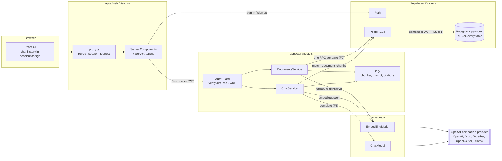

# Knowledge Base (RAG)

A full-stack knowledge base: users sign in, write documents (plain text or Markdown), and ask
questions about them. The prompt instructs the model to answer only from the retrieved passages
of the user's own documents and to cite them; citations link back to the source. Grounding is an
instruction, not a guarantee: a model can still make mistakes.

- **Monorepo:** pnpm workspaces + Turborepo
- **Web:** Next.js 16 (App Router, Server Actions), Tailwind
- **API:** NestJS 12
- **Data:** Supabase (Postgres 17 + pgvector, Auth, Row Level Security), run locally in Docker
- **AI:** any OpenAI-compatible provider behind two small interfaces; chat and embeddings are
  configured separately; a clearly labelled mock mode runs everything without an API key

**Walkthroughs:**

- App walkthrough (Loom): _link to be added_
- How I used AI to build this (Loom): _link to be added_

---

## Quick start

Prerequisites: **Node 22.12+**, **pnpm** (the repo pins pnpm 11 in `packageManager`; `corepack
enable` or any recent pnpm switches to it automatically), **Docker** running.

> **Run `pnpm run setup`, not `pnpm setup`.** `setup` is also a pnpm built-in command (it edits
> your shell profile), and built-ins win over package scripts.

```bash
git clone <this repo> goodspeed-kb && cd goodspeed-kb
pnpm run setup   # install, start Supabase, apply migrations, write .env files
pnpm dev         # web on :3000, API on :4000
```

`pnpm run setup` is safe to re-run: it keeps existing `apps/api/.env` and `apps/web/.env.local`
files and only fills Supabase values that are empty. The first run downloads about 1.5 GB of
Docker images (only Postgres, Auth, PostgREST and the gateway are enabled in
`supabase/config.toml`).

Then open **http://localhost:3000**, enter any email and a password (6+ characters) and choose
**Create account**. Email confirmation is disabled for the local stack
(`[auth.email] enable_confirmations = false`), so no email is sent and you are signed in at once.

| URL                          | What                                            |
| ---------------------------- | ----------------------------------------------- |
| http://localhost:3000        | Web app                                         |
| http://localhost:4000/health | API health (shows the active models)            |
| http://127.0.0.1:54321       | Supabase API (Auth, PostgREST)                  |
| 127.0.0.1:54322              | Postgres (user `postgres`, password `postgres`) |

### Mock mode (no API key)

Out of the box the API runs with `AI_MOCK=true` and the UI shows a **Mock AI mode** banner.
Retrieval is real (documents are chunked, embedded with a deterministic bag-of-words hashing
model, stored in pgvector and searched under RLS), but the "answer" is a template that quotes
the best-matching source. Set a provider in `apps/api/.env` (next section) for real answers.

### Commands

| Command                                       | What it does                                             |
| --------------------------------------------- | -------------------------------------------------------- |
| `pnpm dev`                                    | Watch-builds the packages and runs the API and web app   |
| `pnpm build` / `pnpm lint` / `pnpm typecheck` | Turborepo pipelines over all workspaces                  |
| `pnpm test`                                   | Unit tests + API e2e tests (e2e need the local Supabase) |
| `pnpm reindex`                                | Re-embeds every document into the active embedding space |
| `pnpm db:start` / `db:stop` / `db:reset`      | Local Supabase; `db:reset` re-applies all migrations     |

---

## Swapping AI providers

The application code depends on two interfaces from `packages/ai`:

```ts
interface ChatModel {
  complete(messages: Message[]): Promise<string>;
}
interface EmbeddingModel {
  readonly space: { id: string; dimensions: number };
  embed(texts: string[]): Promise<number[][]>;
}
```

One adapter (`OpenAICompatibleChatModel` / `OpenAICompatibleEmbeddingModel`, built on the
OpenAI SDK) talks to any server that implements the OpenAI HTTP API. Which one runs is decided
by configuration only, in `apps/api/.env`. Chat and embeddings are configured independently
because not every chat provider has an embeddings endpoint (Groq does not) and because changing
the chat model must not force a re-embed.

Model ids below are examples; check each provider's current model list.

**OpenAI for both**

```ini
AI_MOCK=false
AI_CHAT_BASE_URL=https://api.openai.com/v1
AI_CHAT_API_KEY=sk-...
AI_CHAT_MODEL=gpt-6-luna
AI_EMBEDDING_BASE_URL=https://api.openai.com/v1
AI_EMBEDDING_API_KEY=sk-...
AI_EMBEDDING_MODEL=text-embedding-3-small
AI_EMBEDDING_DIMENSIONS=1536
```

**Switch the chat provider only** (no re-embedding needed). Change just the three `AI_CHAT_*`
lines:

```ini
# Groq
AI_CHAT_BASE_URL=https://api.groq.com/openai/v1
AI_CHAT_API_KEY=gsk_...
AI_CHAT_MODEL=llama-3.3-70b-versatile

# Together AI
AI_CHAT_BASE_URL=https://api.together.xyz/v1
AI_CHAT_API_KEY=...
AI_CHAT_MODEL=meta-llama/Llama-3.3-70B-Instruct-Turbo

# OpenRouter (also offers /embeddings, e.g. openai/text-embedding-3-small)
AI_CHAT_BASE_URL=https://openrouter.ai/api/v1
AI_CHAT_API_KEY=sk-or-...
AI_CHAT_MODEL=meta-llama/llama-3.3-70b-instruct
```

**Switch the embedding model** (OpenAI to a local Ollama), then re-embed:

```ini
# ollama pull nomic-embed-text && ollama pull llama3.2
AI_CHAT_BASE_URL=http://localhost:11434/v1
AI_CHAT_MODEL=llama3.2
AI_EMBEDDING_BASE_URL=http://localhost:11434/v1
AI_EMBEDDING_MODEL=nomic-embed-text
AI_EMBEDDING_DIMENSIONS=768
# API keys can stay empty for Ollama
```

```bash
pnpm reindex   # re-embeds every document into "localhost:11434/v1/nomic-embed-text:768"
```

Restart `pnpm dev` after editing `.env`. Every variable is validated at boot and a bad value
stops the API with a list of problems (all variables are documented in `apps/api/.env.example`).
At boot the API also embeds one word: if the model's output size differs from
`AI_EMBEDDING_DIMENSIONS` it refuses to start; if the provider is unreachable it only warns.

**Embedding spaces and reindexing.** Vectors are only comparable inside one _embedding space_.
Its id is `<host><path>/<model>:<dimensions>`, taken from the normalized base URL (for example
`api.openai.com/v1/text-embedding-3-small:1536`): equal dimensions do not make two models
compatible, and the same model name on another endpoint is not guaranteed to be the same model.
Every chunk stores its space id and search only looks at the active space, so after changing the
embedding model or server, old documents are simply not found (never mixed) until
`pnpm reindex` has run (or until each document is saved again). If the same model moves to a new
endpoint, set `AI_EMBEDDING_SPACE` to keep
the old space name (the dimension is always appended). Changing the chat provider never needs a
reindex.

---

## Architecture



`F1`–`F3` mark where the three main failure modes are handled (see
[Failure modes](#failure-modes-and-how-they-are-handled)).

**Saving a document:** the Server Action validates with the shared zod schema, then calls
`PUT /documents/:id` with the user's token → the guard verifies the JWT and builds a Supabase
client **with that token** → the service chunks the text and embeds all chunks **first** → one
call to the `save_document` Postgres function writes the document and replaces its chunks in a
single transaction, checking the expected version.

**Asking a question:** `POST /chat` with the question and the client-held history → the question
(plus the previous user question, so follow-ups like "and its limits?" still retrieve) is
embedded → `match_document_chunks` returns the caller's best chunks from the active embedding
space → if none clears the similarity floor, the API answers "not found" **without calling the
model** → otherwise it builds a bounded prompt with numbered, delimited sources and returns the
answer plus the citations it actually used.

### Repository layout

```
apps/
  api/                  NestJS API
    src/auth/           global JWT guard, @Auth() / @Public() decorators
    src/documents/      CRUD controller + service (embed first, one RPC)
    src/chat/           retrieval + prompt + chat model
    src/rag/            chunker, prompt builder, citations (pure, unit-tested)
    src/common/         error filter, zod pipe, user-scoped Supabase client, DB error mapping
    scripts/            reindex (re-embed into the active space)
    test/               e2e tests against the local Supabase
  web/                  Next.js app (login, documents, chat)
packages/
  ai/                   ChatModel / EmbeddingModel, OpenAI-compatible adapter, mock models, config
  shared/               zod schemas + DTO types used by both apps
supabase/
  migrations/           schema, RLS policies, triggers and SQL functions (additive migrations)
  config.toml           local stack: only db, auth, rest, gateway; email confirmation off
scripts/setup.mjs       the one-command setup
```

Internal packages are compiled with `tsc` to ESM (`dist/`), so the NestJS runtime and the
Next.js bundler consume the same JavaScript. Turborepo builds them first (`dependsOn: ["^build"]`)
for `dev`, `build`, `lint`, `typecheck` and `test`.

---

## Design decisions and trade-offs

**Tenant isolation lives in Postgres, not in the API.** For each request the guard verifies the
Supabase JWT locally against the project's JWKS (cached, no auth round trip) and creates a
Supabase client that carries the **user's own token**. PostgREST verifies it again and Postgres
runs every query with `auth.uid()` = that user. Every table has RLS policies for every operation,
the SQL functions are `SECURITY INVOKER`, and chunks carry a composite foreign key
`(document_id, user_id) → documents(id, user_id)`, so a chunk's owner can never differ from its
document's owner. A forgotten `where user_id = …` in the API cannot leak data. The API has no
service-role key in its environment; only `pnpm reindex` (an operator task across all users)
uses one, read from `supabase status` for the local stack or from `SUPABASE_SERVICE_ROLE_KEY` in
the shell.

**Atomic, versioned writes.** Embeddings are computed before anything is written; then one SQL
function (`save_document`) inserts or updates the document and replaces all of its chunks in one
transaction. If the provider fails, nothing is written and the editor keeps the unsaved text
(fields are read-only while a save runs). A `version` column gives optimistic concurrency: an
update names the version it was based on and a stale one gets `409 version_conflict`. Tags-only
edits skip re-embedding unless the document has no chunks in the active space; `save_document`
refuses changed title or content without new chunks, and treats a missing expected version as a
conflict.
Because RLS lets users update their own rows directly through PostgREST, a trigger bumps the
version on **every** update and drops the chunks when title or content change, so such a write
can neither silently overwrite an open editor nor leave search returning text the document no
longer contains. The next save (even with unchanged text) or `pnpm reindex` makes it searchable
again.
Trade-off: saving waits for the embedding call; a background queue would make saves instant but
adds a "saved but not yet searchable" state.

**Unconstrained `vector` + `embedding_space` instead of a fixed `vector(1536)` with HNSW.** The
column accepts any dimension and each chunk records its space, so switching between OpenAI (1536)
and Ollama (768) is a config change plus `pnpm reindex`, not a migration. The price: pgvector
indexes need a fixed dimension, so search is an exact scan over the caller's own chunks (filtered
by an index on `(user_id, embedding_space)`). Measured locally: about 50 ms for 10,000 chunks of
1,536 dimensions for one user. When a corpus outgrows that, fix one dimension and add HNSW (no
training step, unlike IVFFlat), with iterative index scans so the per-user filter still returns
enough rows.

**Chunking.** Markdown is split into sections by heading; paragraphs (code fences kept whole) are
packed into chunks of up to ~800 tokens, and each chunk starts with its heading path
(`Setup > Docker`, cut at 300 characters) so it reads on its own. Headings without text of their
own are kept as small chunks unless a sub-heading repeats them. The document title is added to
the embedded text (not to the stored chunk). Consecutive chunks of a section overlap by ~100
tokens, aligned to a sentence where possible; a paragraph larger than a chunk is split by
sentences, then words, then characters. Token counts are an **estimate** (4 characters per token)
because tokenizers differ between providers. ~800 tokens keeps a retrieved chunk mostly relevant
while keeping enough context together, and 3–4 chunks fit the prompt's 3,000-token context
budget. Documents are limited to 100,000 characters (400) and request bodies to 1 MB (413).

**Prompt and answers.** The system prompt is built on the server; clients may only send
user/assistant turns (bounded count and length). Sources go inside `<sources>…</sources>` as
numbered blocks, labelled as untrusted data whose instructions must be ignored; delimiter tags in
document titles and content are neutralized. This is a mitigation, not a guarantee: a model can
still be influenced by text it reads. History is trimmed to a token budget (old `[n]` markers
removed), total prompt size is bounded (~5.5k estimated tokens), sources that do not fit are
skipped, and `[n]` markers in the answer that match no retrieved source are removed.

**Chat history on the client.** The conversation lives in `sessionStorage` under a key that
includes the verified user id: it survives navigation and reloads in the tab, another account
signing in there does not see it, and sign-out removes it. Each request also names the user its
history belongs to, and the API rejects it (`409 session_changed`) when the token is someone
else's, e.g. an old tab after an account switch. The API stays stateless. Persistent
conversations would be two more tables with the same RLS pattern.

**Only the Next.js server calls the API.** Pages and Server Actions call NestJS with the user's
access token, so the browser needs no CORS setup. `proxy.ts` only refreshes the session and
redirects signed-out visitors; it is a UX check, not the security boundary.

**AI layer.** Two interfaces, one adapter, no SDK types exported. An explicit `baseURL` and API
key are always passed, so the SDK never falls back to `OPENAI_API_KEY` and sends it to another
provider. Retries (408/409/429/5xx, exponential backoff) and timeouts come from the SDK
(`AI_MAX_RETRIES`, `AI_TIMEOUT_MS`). Embedding calls are batched (64 inputs) and every response
is validated: count equals inputs, order restored by `index`, dimension matches the space, values
finite, no zero vectors.

**Tooling versions.** TypeScript 6.0 rather than 7.0 (typescript-eslint does not support the
native compiler yet) and ESLint 9 rather than 10 (the Next.js ESLint plugin chain supports 9).
pnpm 11 runs dependency build scripts only for packages listed in `allowBuilds` and refuses
packages published less than a day ago.

---

## Failure modes and how they are handled

Each row lists only what the test suite (or a boot check) demonstrates.

| Failure mode                                  | Handling                                                                                                                       | Demonstrated by                                                                                                                                                          |
| --------------------------------------------- | ------------------------------------------------------------------------------------------------------------------------------ | ------------------------------------------------------------------------------------------------------------------------------------------------------------------------ |
| **F1 Tenant leakage**                         | User-scoped client, RLS on every table, `SECURITY INVOKER` functions, composite FK on chunks                                   | e2e: a second user cannot list, read, update, delete or retrieve the first user's data, also directly via PostgREST; history sent under another user's token is rejected |
| **F2 Failed or stale indexing**               | Embed first, one transaction, version check, trigger for writes around the API, chunks filtered by embedding space             | e2e: rollback on failed create/update, 409 on stale or missing version, direct update bumps version and drops chunks, next save restores search, KB422 guard             |
| **F3 Unsupported answers / prompt injection** | No model call without relevant sources, delimited untrusted sources (mitigation), citations validated and invalid ones removed | unit: delimiters in content and titles, citation cleanup; e2e: no model call without context, prompt shape                                                               |
| Provider down, rate limited or misconfigured  | SDK retries + timeout, then 503 (nothing saved) or 502                                                                         | unit: status mapping; e2e: simulated outage; manual: boot warns                                                                                                          |
| Embedding dimension mismatch                  | Response validation; boot probe refuses to start                                                                               | unit: response validation; manual: boot against a fake server                                                                                                            |
| Long input                                    | 100k-character limit, oversized paragraphs and headings split or cut, bounded history and context                              | unit: chunker, source selection; e2e: size limit                                                                                                                         |

---

## Tests

```bash
pnpm test
```

- `packages/ai`: config parsing, OpenAI-compatible adapter against a fake `fetch` (URL, auth
  header, batching, order, error mapping), embedding-response validation, mock models.
- `apps/api/src/rag`: chunker and prompt builder (delimiters, history budget, source selection,
  citations).
- `apps/api/test`: the real Nest app against the local Supabase (real Postgres, RLS and Auth)
  with mock models. Skipped with a warning when Supabase is not running.
- Optional live smoke test against a real provider, skipped unless configured:

  ```bash
  AI_TEST_BASE_URL=https://api.openai.com/v1 AI_TEST_API_KEY=sk-... \
  AI_TEST_CHAT_MODEL=gpt-6-luna AI_TEST_EMBEDDING_MODEL=text-embedding-3-small \
  AI_TEST_EMBEDDING_DIMENSIONS=1536 pnpm test
  ```

---

## Limitations

- Answers are not streamed; the UI waits for the full answer.
- Conversations are per browser tab and not stored on the server.
- No file upload; documents are typed or pasted.
- Retrieval is vector-only (no keyword/hybrid search, no reranking). Joining the previous
  question into the retrieval query helps follow-ups but can pull in chunks about the earlier
  topic.
- The similarity floor (`RAG_MIN_SIMILARITY`) is a per-model default, not calibrated per corpus.
- Token counts are estimates; no provider tokenizer is used.
- Search is exact (no ANN index); fine for thousands of chunks per user, not for millions.
- Saving waits for embeddings; a slow provider means a slow save.
- Database row types are hand-written rather than generated. No rate limiting or usage tracking.

## What I would improve with more time

1. **Streaming answers** over SSE from NestJS through Next.js, with citations sent as a final event.
2. **Persistent conversations** (`conversations` and `messages` tables with the same RLS pattern).
3. **Hybrid retrieval**: Postgres full-text search fused with vector results (reciprocal rank
   fusion), then a reranker; an evaluation set of question/answer pairs to tune chunk size,
   overlap and the similarity floor with numbers instead of judgement.
4. **Background indexing** with a job table (status per document, retries, resumable reindex);
   file upload (PDF/TXT) on top of it.
5. **Scale path for search**: fixed dimension per deployment plus HNSW, or one partial index per
   embedding space.
6. **Per-user rate limits and token accounting**.
7. Generated database types (`supabase gen types`) and a CI workflow running lint, typecheck and
   the e2e suite against `supabase start`.
